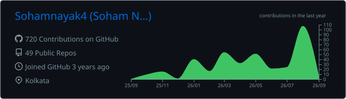
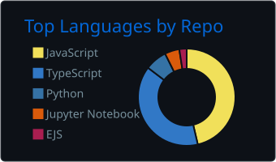
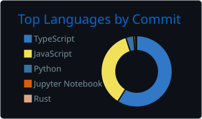
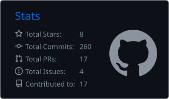
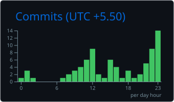

<p align="center">
  <a href="https://x.com/soham_nayak04">
    
  </a>
</p>

<p align="center">
  <a href="https://sohamn.vercel.app"></a>
  <a href="https://x.com/soham_nayak04"></a>
  <a href="https://youtube.com/@Tech-with-soham"></a>
  <a href="mailto:sohamnayak04@gmail.com"></a>
</p>

<br />

## `whoami`

```ts
const soham = {
  role:      "Full-stack developer, solo founder",
  school:    "IIT Bombay",
  stack:     ["TypeScript", "Next.js", "Node", "Postgres", "Supabase"],
  shipped:   ["live messaging", "feed ranking algorithms", "payments", "auth"],
  currently: "building products in public and posting the real numbers",
  openTo:    "full-stack / founding engineer roles (remote preferred)",
} as const;
```

- Built the entire tech for my own startup solo. Live chat and a ranked feed, both from scratch, both new to me when I started.
- Then six months on frontend at Chronicle.
- Now: shipping my own products, writing daily on X, making videos.
- I care about shipping fast and showing the numbers, wins or not.

<br />

## Currently shipping

| Project | What it does | Live |
| :--- | :--- | :--- |
| **Postabl** | Screenshot editor for people who post online. Brand kits, clean exports, zero design skill needed. | [postabl.xyz](https://postabl.xyz) |
| **Xshare** | Paste any X profile, get four share-ready cards in one click. Built in a weekend. | [xshare0.vercel.app](https://xshare0.vercel.app) |
| **TechWithSoham** | AI, tools, and what's actually worth building right now. No hype. | [YouTube](https://youtube.com/@Tech-with-soham) |

> [!NOTE]
> **Open to work.** Full-stack or founding engineer, remote preferred, available immediately.
> Fastest way to reach me is a [DM on X](https://x.com/soham_nayak04) or [email](mailto:sohamnayak04@gmail.com).

<br />

## Stack

**I build with these daily**

<p>
  
</p>

**Comfortable with**

<p>
  
</p>

<br />

## The numbers

<p align="center">
  
</p>

<p align="center">
  
  
  
</p>

<p align="center">
  
</p>

<p align="center">
  
</p>

<br />

## My contributions, eaten by a snake

<picture>
  <source media="(prefers-color-scheme: dark)" srcset="https://raw.githubusercontent.com/Sohamnayak4/Sohamnayak4/output/github-snake-dark.svg" />
  <source media="(prefers-color-scheme: light)" srcset="https://raw.githubusercontent.com/Sohamnayak4/Sohamnayak4/output/github-snake.svg" />
  
</picture>

<br />


